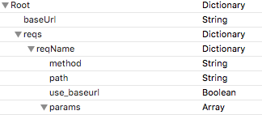
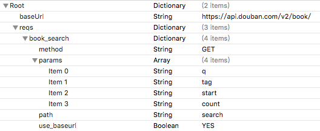
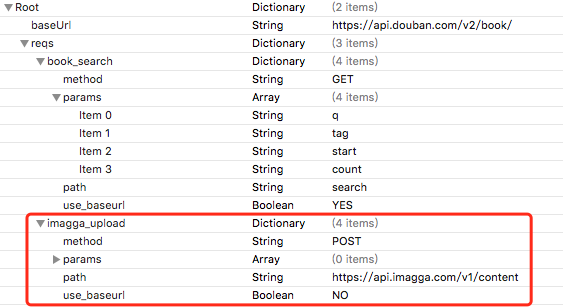

Networking
============

## 简介
基于Alamofire和ObjectMapper，实现通过plist统一管理应用中所有http请求的URL、请求方法、参数等配置信息

## 结构
#### **NWHttpConfigManager**
plist文件配置管理器，负责加载配置信息
#### NWUrlReqFactory
UrlRequest工厂，负责根据`请求名`称创建相应的UrlRequest
#### NWRequest
发送http请求的类，提供了`直接获取Resp对象` 和 `获取Data数据` 两个方法

```
//直接获取Resp对象
func doRequest<Resp:Mappable>(_ request:URLRequest, success: @escaping (_ response:Resp)-> Void, failure:@escaping (_ err:Error)->Void)
//获取Data数据
func doRequest(_ request:URLRequest, success: @escaping (_ response:Data)-> Void, failure:@escaping (_ err:Error)->Void)
```
#### NWDownloadRequest
下载请求类，支持`暂停`和`继续`

```
/// 下载
/// - parameter request:  下载请求
/// - parameter destPath: 下载数据本地存储路径，包含文件名
/// - parameter progress: 下载进度回调
/// - parameter success:  下载成功回调
/// - parameter failure:  下载失败回调
func doDownload(_ url:String, destPath:String , progress:@escaping (_ hasWritten:Int64, _ totalToWrite:Int64) -> Void, success: @escaping (_ response:Data?)-> Void, failure:@escaping (_ err:Error?)->Void)

//暂停下载
func stop()

//继续下载
func resume()
```

#### NWUploadRequest
上传请求类，跟**NWRequest**类似，提供了`直接获取Resp对象` 和 `获取Data数据` 两个方法

```
/// 上传数据，接收Resp对象
/// - parameter request:     上传请求
/// - parameter multDataDic: 构造上传数据的回调
/// - parameter progress:    上传进度回调
/// - parameter success:     上传成功回调
/// - parameter failure:     上传失败回调
func doUploadResp<Resp:Mappable>(_ request:URLRequest,
              multDataBlock:@escaping ()->([(data: Data, name: String)]),
              progress:@escaping (_ hasWritten:Int64, _ totalToWrite:Int64) -> Void,
              success: @escaping (_ response:Resp)-> Void,
              failure:@escaping (_ err:Error)->Void)
 
 /// 上传数据，接收Data对象
/// - parameter request:     上传请求
/// - parameter multDataDic: 构造上传数据的回调
/// - parameter progress:    上传进度回调
/// - parameter success:     上传成功回调
/// - parameter failure:     上传失败回调
func doUploadData(_ request:URLRequest,
              multDataBlock:@escaping ()->([(data: Data, name: String)]),
              progress:@escaping (_ hasWritten:Int64, _ totalToWrite:Int64) -> Void,
              success: @escaping (_ response:Data)-> Void,
              failure:@escaping (_ err:Error)->Void){
```

## 使用说明
### 创建plist配置文件
plist文件格式需符合如下结构：



- **baseUrl**：所有Http请求共同的Url前缀
- **reqs**：Http请求字典，其中key为请求名称，value为该请求的配置信息字典
 -   **key** `reqName`：请求名称
 -   **value **  `字典`：`method`请求方法、`path`子路径、`use_baseurl`是否使用baseUrl、`params`参数名数组

### 设置plist配置文件路径
通过**NWHttpConfigManager**类设置配置文件

```
NWHttpConfigManager.configFilePath = Bundle.main.path(forResource: "`plist文件名`", ofType: "plist")!
```
  
### 定义 Resp
如果希望直接获取http请求返回的数据的对象实例，则要根据接口返回的数据结构为每个接口定义相应的响应类，定义方式参见[ObjectMapper](https://github.com/Hearst-DD/ObjectMapper)

###定义Req
可以直接使用`NWReqFactory`和`NWRequest`创建并发送请求，而不为每个接口单独定义一个Req类。但是在同一个应用中，对同一个请求的创建和处理返回数据的方式一般是相似或完全一致的，所以建议为每个接口定义相应的请求类


## 使用示例
### NWRequest示例
下面以**豆瓣-图书搜索**API为例，展示NWRequest如何使用
#### 创建plist文件
创建HttpConfi.plist文件，内容如下所示：



#### 设置plist配置文件路径
在AppDelegatae中设置Networking使用哪个配置文件

```
func application(_ application: UIApplication, didFinishLaunchingWithOptions launchOptions: [UIApplicationLaunchOptionsKey: Any]?) -> Bool {
        NWHttpConfigManager.configFilePath = Bundle.main.path(forResource: "HttpConfig", ofType: "plist")!
        return true
    }
```

####定义Resp
定义**BookSearchResp**，此处只定义了部分字段，只为说明用法：

```
class BookSearchResp : Mappable{
    var count:Int?
    var start:Int?
    var total:Int?
    var books:[Book]?
    required init?(map: Map){}
    func mapping(map: Map) {
        count <- map["count"]
        start <- map["start"]
        total <- map["total"]
        books <- map["books"]
    }
}

class Book: Mappable {
    var bookId:String = ""
    var price:String = ""
    var title:String = ""
    required init?(map: Map){}
    func mapping(map: Map) {
        bookId <- map["id"]
        price <- map["price"]
        title <- map["title"]
    }
}
```

#### 定义Req
定义**BookSearchReq**

```
class BookSearchReq: NSObject {
    class func sendReq(keyword:String,complete:@escaping (_ succ:Bool, _ result:[Book]?, _ error:Error?)->Void) throws -> NWRequest{
        //调用NWReqFactory创建UrlRequest
        let req = try NWReqFactory.createReq(reqName:"book_search", paramsValue:[keyword])
        //发送请求
        let httpReq = NWRequest()
        httpReq.doRequest(req, success: { (resp:BookSearchResp) in
            //获取图书列表并通过回调返给上层
            if let books = resp.books {
                complete(true,books,nil)
            }else{
                complete(false,nil,NSError(domain: "Networking", code: -1, userInfo: [NSLocalizedDescriptionKey:"未获取到图书信息"]))
            }
        }) { (err:Error) in
            complete(false,nil,err)
        }
        return httpReq
    }
}
```

#### 调用

```
do{
    let req = try BookSearchReq.sendReq(keyword: "理财") { (succ:Bool,result:[Book]?, err:Error?) in
        if succ && result != nil{
            let books = result!
            //TODO:添加业务逻辑
        }
    }
}catch{
    print("\(error.localizedDescription)")
}
```

### NWDownloadRequest示例

```
//下载
do{
    let url = "文件地址"
    var path = "保存文件的沙盒路径"
    self.req = NWDownloadRequest()
    self.req!.doDownload(url, destPath: path, progress: { (recived:Int64, total:Int64) in
        print("完成：\(Float(recived)/Float(total)*100)%")
        }, success: { (result:Data?) in
            print("下载完成")
        }, failure: { (err:Error?) in
            print("下载失败：\(err?.localizedDescription)")
    })
}catch{
    print("\(error.localizedDescription)")
}

//暂停
self.req?.stop()
//继续
self.req?.resume()
```
### NWUploadRequest示例
该示例使用`imagga`上传图片API，该API需要设置http header **Authorization**字段，所以需要先在`imagga`官网注册账号并获取**Authorization**
<<<<<<< HEAD
####plist配置
=======
#### plist配置
>>>>>>> 9c5ee07b645f2163e080f3f7c52c25711a1997d4



#### 定义ImaggaUploadResp

```
class ImaggaUploadResp: Mappable {
    var status:String = ""
    var uploaded:[ImaggaUploadItem] = []

    required init?(map: Map){}
    func mapping(map: Map) {
        status <- map["status"]
        uploaded <- map["uploaded"]
    }
}

class ImaggaUploadItem:Mappable{
    var itemId:String = ""
    var fileName:String = ""
    required init?(map: Map){}
    func mapping(map: Map) {
        itemId <- map["id"]
        fileName <- map["filename"]
    }
}
```

#### 调用

```
//上传
do{
    let imData = UIImagePNGRepresentation(UIImage(name:"图片名称"))
    let req = try NWUrlReqFactory.createUploadReq(reqName: "imagga_upload", header: ["Authorization":"从imagga官网获取的Authorization","Content-Type":"multipart/form-data"])
    NWUploadRequest().doUploadResp(req, multDataBlock: { () -> ([(data: Data, name: String)]) in
        return [(imgData,"img1")]
        }, progress: { (recived:Int64, total:Int64) in
            print("完成：\(Float(recived)/Float(total)*100)%")
        }, success: { (resp:ImaggaUploadResp) in
            print("已成功上传")
        }, failure: { (err:Error) in
            print("上传失败：\(err.localizedDescription)")
    })
}catch{
    print(error.localizedDescription)
}
```
